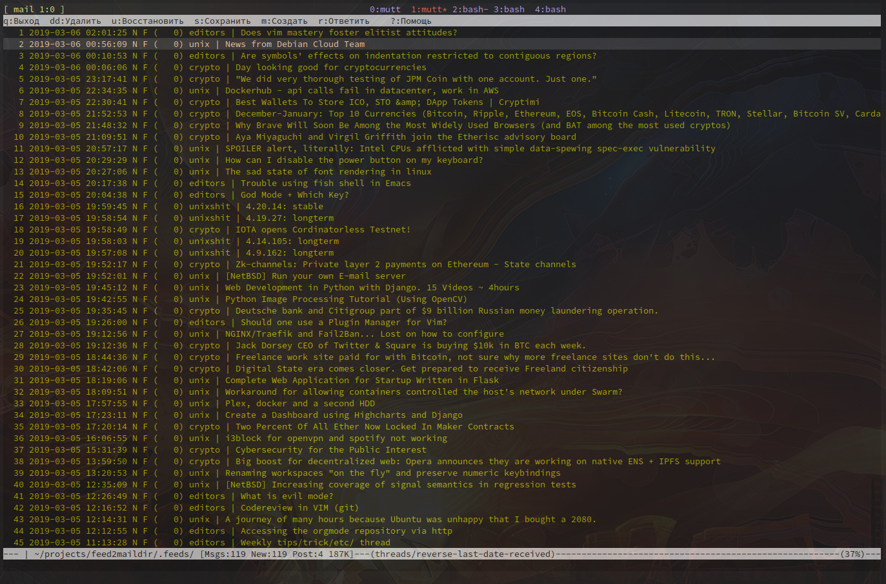

Look at [The Universal Aggregator](https://github.com/sloonz/ua)

\
\
\
\
\
\
\
\
\
\
\
\
\
\
\
\
\
\
\
\
\
\
\
\
\
\
\
\
\
\
\
\
\
\
\
\
\
\ 
\
\
\
\
\
\
\
\
\
\
\
\
\
\
\
\
\
\
\
\
\
\
\
\
\
\
\
\
\
\
\
\
\
\
\
\
\
\ 


```
./example.py
INFO:root:Fetch https://www.reddit.com/r/Bitcoin+CryptoCurrency+BTCNews+ethereum/.rss
INFO:root:Fetch https://www.schneier.com/blog/atom.xml
INFO:root:Fetch https://www.reddit.com/r/vim+emacs+SpaceVim/.rss
INFO:root:Fetch https://www.reddit.com/r/debian+django+docker+awesomewm+NixOS+ranger+i3wm+linux+linuxmasterrace+Python+unix+TempleOS_Official/.rss
INFO:root:Fetch https://www.kernel.org/feeds/kdist.xml
INFO:root:Fetch https://www.reddit.com/r/cellular_automata/.rss
```




### tools

```
./fetch-feed
Usage:
  fetch-feed [--invalidate] [--cache=<cache>] <url>
  fetch-feed (-h | --help)
```
  
```
./parse-feed
Usage:
  feed2json [--raw] (<filename> | -)
  feed2json (-h | --help)
```
  
```
./transform-content
Usage:
  transform-content (--text | --markdown) (<filename> | -)
  transform-content (-h | --help)
```
  
```
./to-maildir
Usage:
  to-maildir [--template=<template>] (<filename> | -) <maildir>...
  to-maildir (-h | --help)
```

#### cli

```
./fetch-feed https://news.ycombinator.com/rss 2>/dev/nulll | ./parse-feed - | jq '.[0]'
{
  "feed": {
    "url": "https://news.ycombinator.com/",
    "subtitle": "Links for the intellectually curious, ranked by readers.",
    "title": "Hacker News"
  },
  "title": "Achieving 100k connections per second with Elixir",
  "url": "https://stressgrid.com/blog/100k_cps_with_elixir/",
  "tags": [],
  "content": {
    "text/html": "<a href=\"https://news.ycombinator.com/item?id=19311750\">Comments</a>"
  },
  "published": "Tue, 5 Mar 2019 16:40:19 +0000",
  "id": "12ffe9847de5618452fbeed124302c69"
} 
```

```
./fetch-feed https://news.ycombinator.com/rss | ./parse-feed - | ./transform-content --text - | ./to-maildir - test/ 
./fetch-feed https://news.ycombinator.com/rss | ./parse-feed - | ./transform-content --text - | ./add-prefix - "programming" | ./to-maildir - test/
```

#### Examples

##### convert a feed to simplified json version via [feedparser](https://pythonhosted.org/feedparser/index.html)

```
./fetch-feed https://www.reddit.com/r/unixporn/.rss | ./parse-feed - | ./transform-content --text - | jq '.[0]'
{
  "url": "https://www.reddit.com/user/upmo",
  "content": {
    "text/html": "\nThis is a thread to get answers for all your questions, no matter how stupid you think it may be. Feel free to share your default setups here too, someone might have some pointers for what to do next. In short you can make any on topic comment, in any format you like, and using any host. We hope this gives new users a chance to get some help with any problems they're having and older users a chance to show off their knowledge by helping those in need.\n\n\n[Contact](https://www.reddit.com/message/compose?to=%2Fr%2Funixporn) [us](https://www.reddit.com/message/compose?to=%2Fr%2Funixporn) if our bot has messed up\n\nsubmitted by [ /u/upmo ](https://www.reddit.com/user/upmo)\n[[link]](https://www.reddit.com/r/unixporn/comments/aw1d8y/weekly_workshop_20190301/) [[comments]](https://www.reddit.com/r/unixporn/comments/aw1d8y/weekly_workshop_20190301/)"
  },
  "published": "2019-03-01T06:00:00+00:00",
  "id": "0de2c338f0ca2ac242f2f30fbcae21a7",
  "title": "| Weekly Workshop 2019-03-01"
}
``` 

##### content transformations

```
./fetch-feed https://news.ycombinator.com/rss 2>/dev/null | ./parse-feed - | jq '.[0].content'
{
  "text/html": "<a href=\"https://news.ycombinator.com/item?id=19311750\">Comments</a>"
}
```

```
./fetch-feed https://news.ycombinator.com/rss 2>/dev/null | ./parse-feed - | ./transform-content --markdown - | jq '.[0].content'
{
  "text/html": "[Comments](https://news.ycombinator.com/item?id=19311750)\n\n"
}
```

```
./fetch-feed https://news.ycombinator.com/rss 2>/dev/null | ./parse-feed - | ./transform-content --text - | jq '.[0].content'
{
  "text/html": "[Comments](https://news.ycombinator.com/item?id=19311750)"
} 
```

##### put a feed items to maildir

```
$ ./fetch-feed https://news.ycombinator.com/rss 2>/dev/null | ./parse-feed - | ./to-maildir - ./maildir

$ tree ./maildir/
./maildir/
├── cur
├── new
│   ├── 1551748999-1a93eae6561fce8582e75f8f19bb96d7
│   ├── 1551753724-c31a47b60d477655af866a429574386e
│   ├── 1551775649-f810cdcd38b45e5a257446ab310a7a96
│   └── ...
└── tmp
```